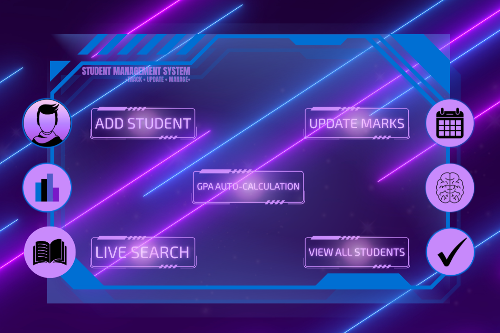

# 🔷 Student Management System
🎓 Track • Update • Manage

A console-based Python project to manage student records — using basic logic, loops, and functions. This is a Python-based Student Management System that allows users to efficiently add, view, search, update, and delete student records — with auto GPA calculation based on marks.

> Poster Logic → Functional Flow  
> All core features are reflected visually through a sci-fi HUD-inspired interface:  
> Add Student • Update Marks • GPA Auto-Calculation • Live Search • View All

---

## 🚀 Features

- Add Student  
  - Input Name, Age, Subject, Marks  
  - GPA is calculated automatically (Marks ÷ 10)

- View All Students  
  - Lists all saved students with details

- Search Student  
  - Lookup by name and view full profile

- Update Marks  
  - Modify marks and refresh GPA

- Delete Student  
  - Remove a student record safely with confirmation

- Live Validations  
  - For marks, age, menu choices, and empty fields

---

## 🧠 Technologies Used

- Language: Python 3  
- Concepts: Functions, Lists, Dictionaries, Input Validation, Loops, Conditional Logic  
- Design: Terminal-based logic + HUD-inspired poster

---

## 🖼️ Poster Preview



---

## 💡 How to Run

1. Clone the repo or download the Python file  
2. Run it using:  
   `python student_management_v1.py`  
3. Follow the on-screen menu options

---

## ⚠️ Note on Data Storage

This version does **not** save data permanently.  
All student records are stored in memory only during runtime.  
Once the program ends, the data is lost.  
This is intentional for educational/demo purposes.

---

## 📋 Sample Output

```
1. Add New Student
2. View All Students
3. Search Student by Name
4. Update Student Marks
5. Delete Student
6. Exit
Enter your choice: 1
Enter your name: Yashodhan
Enter your age: 19
Enter subject name: Python Programming
Enter your marks in Python Programming: 92

1. Add New Student
2. View All Students
3. Search Student by Name
4. Update Student Marks
5. Delete Student
6. Exit
Enter your choice: 2

------Student 1------
Name: Yashodhan
Age: 19
Subject: Python Programming
Marks: 92
GPA: 9.2
---------------------
```

---

## 🧑‍💻 Developer

Yuval Shah
GitHub & LinkedIn: [@yuvalshahtech](https://github.com/yuvalshahtech)

---

## 🧭 System Purpose

This system is built to help users manage student records through a terminal interface.  
It includes all essential operations with basic input validation and GPA logic.

---
